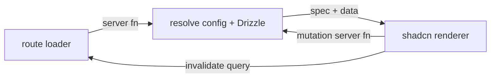

# FilamentJS — Design Spec

A lightweight, server-driven admin panel framework for TypeScript, inspired by Filament (PHP/Laravel). Define resources, forms, and tables as typed config objects; the server resolves and renders them.

Scope for v1: **panel shell + forms + tables** only. No infolists, actions-as-standalone-package, widgets, notifications, or tenancy yet.

## Stack

| Concern | Choice |
|---|---|
| Framework | TanStack Start (router, server functions, loaders) |
| Data/cache | TanStack Query |
| Table render | TanStack Table |
| Form state | TanStack Form |
| UI components | shadcn/ui |
| DB | Postgres via Drizzle ORM |
| Auth | better-auth |
| Tests | Vitest + real Postgres (no mocks) |
| Repo | pnpm monorepo |

## Core mental model

Everything is a **serializable config object** that lives and resolves on the server. The client receives only the data plus the minimal view-spec it needs to paint, and handles cheap local interactivity itself.

```
definePanel({ resources, nav, auth, theme })
  └─ defineResource({ model, form, table })   // static config bound to one Drizzle table
       ├─ form:  Schema  (fields + layout nodes)
       └─ table: Table   (columns, filters, actions)

config (server-only) ──► loader / server fn ──► { spec, data } ──► client renders (TanStack + shadcn)
```

A Resource does not generate pages. Pages (List/Create/Edit/View) are generic components parameterized by the resource, matching Filament's model.

## Package layout

```
filamentjs/
├─ packages/
│  ├─ core        SchemaNode types, config builders, ctx/closure resolution
│  ├─ forms       field builders (text, select, ...) + <FormRenderer>
│  ├─ tables      column/filter/action builders + <TableRenderer>
│  └─ panels      definePanel / defineResource, generic pages, shell, nav
└─ apps/
   └─ playground  TanStack Start app: Drizzle+Postgres, better-auth, demo resources
```

`core` is Filament's `schemas` engine: the shared recursive node tree and the `prop | (ctx) => prop` resolution. `forms` and `tables` build on it. `panels` wires it into routes and the shell.

### Prop resolution (core)

```ts
type Prop<T> = T | ((ctx: Ctx) => T);
type Ctx = { get(path: string): unknown; set(path: string, v: unknown): void; record?: Row; values: Record<string, unknown> };
```

Any config prop is either a literal or a function resolved against current state. Cheap predicates (reading sibling state) are serialized and run client-side; anything needing the DB round-trips via a server fn.

## Forms

```ts
form: (f) => [
  f.text('name').required().maxLength(255),
  f.text('email').email().required().unique(),
  f.select('role').options({ admin: 'Admin', user: 'User' }).default('user'),
  f.toggle('active').live(),
  f.section('Profile', [
    f.textarea('bio').visible((ctx) => ctx.get('active')),
  ]),
]
```

- **Fields vs layout**: fields carry a `name` (state path); layout nodes (`section`, `grid`, `tabs`, `wizard`) do not, they only nest children. State path flows through layout transparently.
- **State**: a flat `statePath -> value` store, mirroring Filament.
- **Reactivity**: `.visible / .disabled / .required(ctx => ...)` predicates. `.live()` marks a field that re-evaluates the schema on change. Cheap re-evals run client-side; DB-dependent ones round-trip.
- **Lifecycle**: hydrate (DB row -> form state) and dehydrate (form state -> save payload), matching Filament's cast pipeline. Hidden fields stripped from payload by default.
- **Validation**: declared fluently, compiled to a Zod schema. Client shows light hints; the server is authoritative on submit.

### v1 field types

| Group | Types |
|---|---|
| Text | text, textarea |
| Choice | select, multiSelect, radio, checkboxList |
| Boolean | checkbox, toggle |
| Date | datePicker, dateTimePicker |
| Layout | grid, section, tabs, wizard |

Deferred: rich editor, file upload, repeater, builder, key-value.

## Tables

```ts
table: (t) => ({
  columns: [
    t.text('name').sortable().searchable(),
    t.text('author.name').label('Author'),   // dot path -> Drizzle relation join
    t.badge('role').colors({ admin: 'red' }),
    t.boolean('active').sortable(),
  ],
  filters: [
    t.select('role').options({ admin: 'Admin', user: 'User' }),
    t.ternary('active'),
  ],
  actions: [t.editAction(), t.deleteAction()],
  bulkActions: [t.deleteBulkAction()],
  headerActions: [t.createAction()],
})
```

- **Columns**: value = column "state", resolved by walking the dot path on the row or running an `accessor` fn. Dot notation traverses Drizzle relations (auto join/eager-load) or JSON keys.
- **Column state resolution**: `walk(row, dotPath)` else `accessor(row)`, matching Filament.

### Server-driven data contract

```ts
type TableParams = {
  sort?: string; dir?: 'asc' | 'desc';
  search?: string; columnSearches?: Record<string, string>;
  filters?: Record<string, unknown>;
  page: number; pageSize: number;
};

// client posts params -> server resolves via Drizzle -> returns page
createServerFn({ method: 'POST' })
  .validator((p: TableParams) => p)
  .handler(({ data }) => resolveQuery(resource, data)); // -> { rows, total }
```

Query pipeline (server, SQL): base query -> apply filters -> apply search -> apply sort -> paginate.

- **Search**: every `searchable()` column contributes; global term OR-matched across them. `columnSearches` handles per-column search.
- **Filters**: each filter = `{ name, type, options?, apply(query, value) }`. `select` auto-scopes `where(col, value)` / `whereIn` if multiple; `ternary` = 3-state (true/false/blank).
- **Actions**: `{ name, label, icon, requiresConfirmation?, visible?(row), handler(row|rows, formData?), form?: Schema }`. Row actions run per record; bulk actions over a selection; header actions are global (e.g. create). Handlers run server-side by id/ids.

TanStack Query drives refetch and cache invalidation; TanStack Table handles client render, column visibility, and sort UI.

## Panel shell + routing

```ts
definePanel({
  path: '/admin',
  resources: [userResource, postResource],
  nav: { groups: ['Access', 'Content'] },
  auth: betterAuthConfig,
  theme: { brand: 'FilamentJS', primary: 'amber' },
})
```

Each resource compiles to TanStack Start routes backed by generic page components:

```
/admin/$resource                ListPage    (loader: resolve table page)
/admin/$resource/create         CreatePage  (loader: empty form spec)
/admin/$resource/$record        ViewPage    (loader: record + read-only spec)
/admin/$resource/$record/edit   EditPage    (loader: form spec + record)
```

- **Shell**: shadcn sidebar (nav built from resources that opt into navigation, grouped) + topbar + user menu.
- **Nav**: each resource yields a nav item (label, icon, group, sort, active-when). Groups render as sidebar sections.
- **Auth**: better-auth guards the `/admin` route tree; unauthenticated users redirect to login.

## Data flow



## Testing strategy

- **Vitest** for `core` (prop/closure resolution, state paths, hydrate/dehydrate) and `tables` query building.
- **Real Postgres** (docker or testcontainers) for the data-contract tests: table params in, correct rows/total out. No mocks.
- Playground app doubles as an integration harness with real demo resources (Users, Posts).

## Module boundaries

| Module | Does | Depends on |
|---|---|---|
| core | node tree, prop resolution, state store | (none) |
| forms | field/layout builders, form renderer, validation compile | core |
| tables | column/filter/action builders, query resolver, table renderer | core |
| panels | resource/panel config, generic pages, shell, routing, auth wiring | core, forms, tables |
| playground | demo app, DB schema, better-auth setup | panels |

Each module is understandable and testable on its own: you can describe what it does, how to use it, and what it depends on without reading internals.

## Out of scope for v1

Infolists, standalone actions package, widgets/dashboard, notifications, tenancy/multi-tenant, relation managers, global search, plugins, SPA-mode nav, file uploads, rich text, repeaters. These are natural follow-ups once the three core packages are solid.
